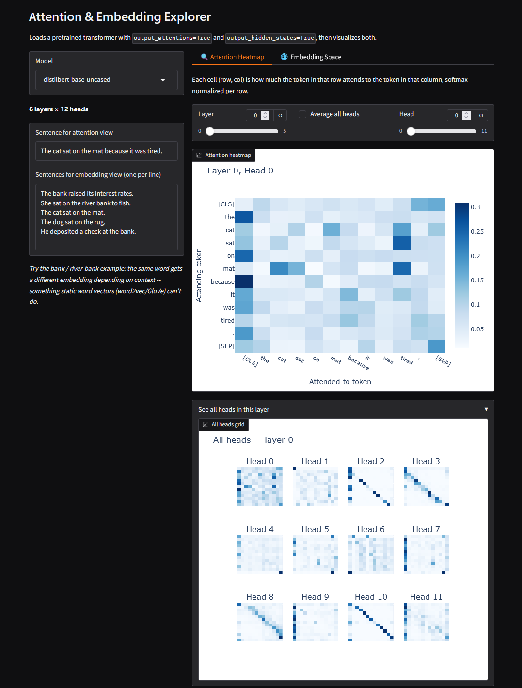

# Attention & Embedding Explorer

An interactive tool for looking inside a pretrained transformer instead of
treating it as a black box. It loads a real model (DistilBERT, BERT, or
RoBERTa) with `output_attentions=True` and `output_hidden_states=True`,
runs it on text you provide, and visualizes two things directly: which
tokens each attention head attends to, and how token/sentence embeddings
are organized at each layer.



## Why this exists

Attention and embeddings are usually explained with static diagrams from
a paper, run on someone else's example sentence. This app runs the real
model on your own sentences, live, so you can test an intuition instead
of just reading about it.

**Use cases:**

- **Building intuition for how attention works.** Step through layers and
  heads on a sentence with a pronoun or an ambiguous word (*"the trophy
  didn't fit in the suitcase because **it** was too big"*) and watch
  which heads resolve the reference.
- **Comparing architectures.** Switch between DistilBERT (6 layers) and
  BERT-base (12 layers) on the same sentence to see how attention
  patterns differ with depth and head count, or compare BERT vs RoBERTa.
- **Demonstrating contextual embeddings.** The default example sentences
  include *"the **bank** raised its interest rates"* vs *"she sat on the
  river **bank**"* — the same word gets a different embedding depending
  on context, which static word vectors (word2vec/GloVe) can't do. Useful
  for explaining, in one glance, why transformers replaced those methods.
- **Spotting attention-head behavior patterns.** The "see all heads"
  grid view makes it easy to scan a whole layer at once for heads that
  specialize -- e.g. a head that mostly attends to the previous token, or
  one that collapses onto `[SEP]`.
- **Teaching or interview prep.** A faster way to show (rather than
  explain) what "attention" and "contextual embedding" mean concretely.

## How it works

- **Attention Heatmap tab:** pick a model, layer, and head; see a
  token-by-token heatmap of attention weights (each row sums to 1, since
  it's a softmax over keys). An "average all heads" toggle and a "see all
  heads in this layer" grid view are included for comparing heads.
- **Embedding Space tab:** enter one or more sentences (one per line),
  pick a hidden-state layer, and the token- or sentence-level embeddings
  at that layer get reduced to 2D/3D (PCA or UMAP) and plotted, with
  hover tooltips showing the actual token and sentence.

## Run locally

```bash
git clone <this-repo-url>
cd attention-embedding-explorer
pip install gradio  # any recent version; see note in requirements.txt
pip install -r requirements.txt
python app.py
```

This prints a local URL (default `http://127.0.0.1:7860`) to open in your
browser. First run downloads the selected model's weights from the
Hugging Face Hub (a few hundred MB for DistilBERT/BERT-base) -- expect a
short pause the first time you pick a model.

## Run the tests

```bash
pip install pytest
pytest tests/ -v
```

The tests run against a tiny locally-constructed model (random weights,
small vocab) rather than a real pretrained checkpoint, so the suite is
fast and doesn't need network access or GPU.

## Project structure

```
app.py               # Gradio UI -- Blocks layout, event wiring, plotting
model_utils.py        # Model loading, attention/embedding extraction, dim reduction
requirements.txt
tests/
  test_model_utils.py   # tests the model/data logic
  test_app.py            # tests the UI's render functions
```

`model_utils.py` is kept free of any Gradio/Plotly code on purpose --
it's the part worth unit testing, and it's reusable if you ever want a
CLI or notebook version instead of the web UI.

## Notes on a couple of non-obvious implementation details

- **`attn_implementation="eager"`** is set explicitly when loading the
  model. Recent `transformers` versions default new models to `sdpa`
  attention, which does not support returning attention weights --
  `output_attentions=True` silently comes back empty otherwise.
- **UMAP uses `init="random"`** instead of its default spectral
  initialization, which fails outright on very small sample counts (a
  handful of sentences → a few dozen tokens). Random init is more robust
  at this scale, at negligible cost to layout quality.